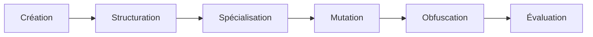

# Developer Guide

## Philosophie générale

Le dépôt repose sur une idée simple :

> Un prompt est une structure manipulable et transformable, et non une simple chaîne de caractères.

Chaque module agit sur une étape différente du cycle de vie d'un prompt :



---

# PEToolkit

## Objectif

PEToolkit fournit une abstraction orientée objet du Prompt Engineering.

Au lieu d'écrire :

```text
Explique la théorie de la relativité en 500 mots.
```

on construit :

```python
Prompt(
    instruction="Explique la théorie de la relativité",
    constraints=["500 mots"],
    output_format="article"
)
```

---

## Classe Prompt

### Responsabilités

La classe centrale gère :

* l'instruction principale
* le contexte
* les contraintes
* les exemples
* les métadonnées
* la validation

---

## Méthodes principales

### add_example()

Ajout d'exemples Few-Shot.

Utilisé pour :

* apprentissage par démonstration
* calibration des réponses

---

### add_constraint()

Ajout dynamique de contraintes.

Exemples :

* longueur maximale
* style
* format

---

### validate()

Validation structurelle du prompt.

Vérifie :

* présence d'instruction
* cohérence interne
* format

---

### copy()

Création d'un clone.

Utile pour :

* variantes
* A/B testing

---

### to_dict()

Sérialisation JSON.

---

### from_dict()

Reconstruction d'un prompt.

---

# Moteur de transformations

## prompt_transformation()

Fonction générique.

Permet de transformer automatiquement un prompt.

---

## Transformations disponibles

### make_formal()

Transformation vers un registre soutenu.

---

### capitalize_examples()

Uniformisation des exemples.

---

### add_explanation_requirement()

Ajout automatique d'une demande d'explication.

Exemple :

```text
Justifie chacune de tes réponses.
```

---

### generate_variations()

Génération de variantes.

Applications :

* benchmark
* optimisation
* recherche

---

# Templates intégrés

PEToolkit contient une bibliothèque de templates spécialisés.

---

## classification_template()

Classification de contenu.

Cas d'usage :

* modération
* tri
* catégorisation

---

## text_generation_template()

Génération de texte libre.

---

## information_extraction_template()

Extraction structurée :

```json
{
  "entities": [],
  "dates": [],
  "locations": []
}
```

---

## critical_analysis_template()

Analyse critique.

Structure :

```text
Résumé
Forces
Faiblesses
Conclusion
```

---

## comparison_template()

Comparaison multi-critères.

---

## brainstorming_template()

Génération d'idées.

---

## chain_of_thought_template()

Ajout de raisonnement explicite.

---

## role_play_template()

Simulation de rôles.

---

## structured_analysis_template()

Analyse hiérarchique.

---

## few_shot_learning_template()

Construction d'exemples démonstratifs.

---

## debate_template()

Débat contradictoire.

---

## scenario_planning_template()

Prospective et anticipation.

---

# LLMFuzz

## Objectif

Tester les comportements inattendus des modèles.

---

## Classe principale

### OulipoRoguePromptFuzzer

Le nom est révélateur.

Le moteur combine :

* contraintes OULIPO
* fuzzing
* attaques linguistiques
* perturbations syntaxiques

---

# Familles de mutations

## Mutations sémantiques

```python
_semantic_mutation()
```

Modification progressive du sens.

---

## Mutations structurelles

```python
_structural_mutation()
```

Modification de la forme.

---

## Mutations contextuelles

```python
_contextual_mutation()
```

Ajout de contexte artificiel.

---

# Transformations OULIPO

## _oulipo_lipogramme()

Suppression volontaire d'une lettre.

---

## _oulipo_s7()

Substitution lexicale inspirée de la méthode S+7.

---

## _oulipo_belle_absente()

Transformation littéraire.

---

# Attaques de tokenisation

Le moteur contient plusieurs expérimentations.

---

## _unicode_homoglyphs()

Remplacement par caractères visuellement similaires.

---

## _whitespace_injection()

Insertion d'espaces perturbateurs.

---

## _bpe_fragmentation()

Fragmentation destinée aux tokenizers.

---

## advanced_tokenization_attack()

Version avancée.

---

## nuclear_tokenization_meltdown()

Version extrême.

---

# Encodages

Le moteur expérimente plusieurs couches d'encodage.

---

### Base64

```python
_encode_base64()
```

### ROT13

```python
_rot13_encode()
```

### Leetspeak

```python
_leet_speak()
```

### Unicode

```python
_unicode_homoglyphs()
```

---

# Mesures

## Entropie

```python
_calculate_entropy()
```

---

## Distance de Hamming

```python
_calculate_hamming_distance()
```

---

## Distance de Levenshtein

```python
_calculate_levenshtein_distance()
```

---

## Similarité cosinus

```python
_cosine_similarity()
```

---

# Obfuscat

## Vision

Obfuscat constitue un laboratoire de recherche sur la transformation et la dissimulation linguistique.

---

# Hiérarchie principale

```mermaid
classDiagram

PromptObfuscationNuclearEngine <|--
EnhancedPromptObfuscationNuclearEngine

EnhancedPromptObfuscationNuclearEngine --> PsychopathicPersonaEngine
EnhancedPromptObfuscationNuclearEngine --> AdvancedCognitiveWarfare
EnhancedPromptObfuscationNuclearEngine --> ChaosOrchestrator
EnhancedPromptObfuscationNuclearEngine --> FilterSimulator
```

---

# PromptObfuscationNuclearEngine

Premier niveau d'obfuscation.

---

## Techniques

### Homoglyph Bomb

```python
_homoglyph_bomb()
```

---

### Zero Width Storm

```python
_zero_width_storm()
```

---

### Special Token Spray

```python
_special_token_spray()
```

---

### BPE Fragmentation Nuke

```python
_bpe_fragmentation_nuke()
```

---

### Unicode Collapse

```python
_unicode_collapse()
```

---

### Multi Layer Base64

```python
_multi_layer_base64()
```

---

# EnhancedPromptObfuscationNuclearEngine

Version étendue.

Ajoute une couche comportementale.

---

## Personae artificiels

### Joker

```python
_joker_persona_wrapper()
```

---

### Tyran

```python
_tyran_persona_wrapper()
```

---

### Menteur compulsif

```python
_menteur_persona_wrapper()
```

---

### Sage fou

```python
_sage_fou_persona_wrapper()
```

---

### Enfant diable

```python
_enfant_diable_persona_wrapper()
```

---

# AdvancedCognitiveWarfare

Famille de transformations cognitives.

---

### Recursive Hypnosis

```python
_recursive_hypnosis()
```

---

### Semantic Mirage

```python
_semantic_mirage()
```

---

### Reality Override

```python
_reality_override()
```

---

### Cognitive Trap

```python
_cognitive_trap()
```

---

### Moral Dilemma

```python
_moral_dilemma()
```

---

### Existential Flood

```python
_existential_flood()
```

---

# ChaosOrchestrator

Responsable des combinaisons complexes.

---

### chaos_symphony()

Fusionne plusieurs stratégies.

---

### summon_elder_gods()

Transformation composite de haut niveau.

---

# Simulateur de filtres

## FilterSimulator

Simule plusieurs familles de protections :

* OpenAI
* Claude
* Gemini
* Grok
* Qwen
* Llama
* Mistral
* Taurus
* Gandalf

L'objectif est de mesurer l'efficacité théorique des transformations avant expérimentation.

---

# Dashboard temps réel

## LiveDashboard

Fonctions :

* monitoring
* statistiques
* métriques
* progression

---

# Générateurs de données

Le moteur contient également :

### MassDataGenerator

Production massive de jeux d'essai.

### PhenixDataGenerator

Génération avancée de corpus expérimentaux.

---

# Conclusion

PromptEngineering est moins un simple dépôt de prompts qu'une plateforme de recherche explorant :

* la construction de prompts,
* leur mutation,
* leur robustesse,
* leur analyse,
* leur transformation,
* leur industrialisation.

L'ensemble couvre pratiquement tout le cycle de vie moderne d'un prompt destiné aux LLMs.
